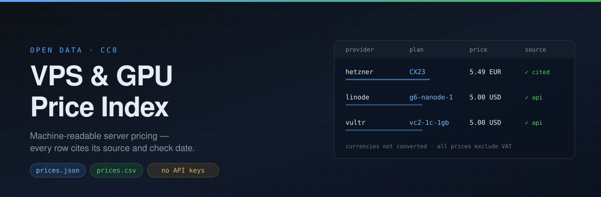

<p align="center">
  
</p>

# VPS & GPU Price Index

Open, source-cited pricing data for VPS and GPU cloud servers, as machine-readable JSON and CSV.

Every row carries the URL it came from and the date it was last checked. Nothing is estimated, converted, or filled in from memory.

[](data/)
[](LICENSE)
[](#methodology)

## Why this exists

Comparison articles go stale quietly. A provider changes its lineup, the article keeps the old figure, and the number gets copied onward for months.

Hetzner is the current example. On 15 June 2026 it did two things at once: it raised prices, and it rotated plan generations. `CX22`, `CX32` and `CX42` stopped being orderable, replaced by `CX23`, `CX33` and `CX43`. A page still quoting "Hetzner CX22 from €3.79" is naming a plan you cannot buy at a price that no longer applies. The entry tier is €5.49 excluding VAT.

The other half is less obvious: the widely repeated "Hetzner went up about 30%" only holds for the CX and CAX lines. In DE/FI the CPX and CCX lines **more than doubled** — CPX22 +144%, CPX32 +154%, CCX13 +169%, CCX23 +173%. A single summary percentage hides that completely.

This index exists so a claim about a price can be traced to a source and a date.

## The data

| File | Use |
|---|---|
| [`data/prices.json`](data/prices.json) | Full index with provenance metadata |
| [`data/prices.csv`](data/prices.csv) | Same rows, flat, for spreadsheets |
| [`sources/*.json`](sources/) | Hand-verified inputs, one file per provider |

```bash
curl -sL https://raw.githubusercontent.com/frechdi/vps-gpu-price-index/main/data/prices.json
```

Cheapest x86 plan per provider:

```bash
curl -sL https://raw.githubusercontent.com/frechdi/vps-gpu-price-index/main/data/prices.json \
  | jq -r '.records | group_by(.provider)[]
           | min_by(.price_monthly)
           | "\(.provider)\t\(.plan)\t\(.price_monthly) \(.currency)"'
```

### Record shape

```json
{
  "provider": "hetzner",
  "plan": "CX23",
  "label": "Hetzner Cloud",
  "vcpu": 2,
  "ram_gb": 4,
  "disk_gb": 40,
  "arch": "x86",
  "gpu": null,
  "price_monthly": 5.49,
  "price_hourly": null,
  "currency": "EUR",
  "vat_included": false,
  "region": "DE/FI (Falkenstein, Nuremberg, Helsinki)",
  "collection": "manual",
  "source_url": "https://docs.hetzner.com/general/infrastructure-and-availability/price-adjustment/",
  "verified_date": "2026-08-03"
}
```

`collection` tells you how the row was obtained: `api` means it was read from the vendor's own public endpoint at build time, `manual` means a person transcribed it from the cited page on `verified_date`.

## Coverage

| Provider | Rows | How | Source |
|---|---|---|---|
| Vultr | ~150 | `api` | `api.vultr.com/v2/plans` |
| Linode (Akamai) | ~45 | `api` | `api.linode.com/v4/linode/types` |
| Hetzner Cloud | 11 | `manual` | [docs.hetzner.com price adjustment](https://docs.hetzner.com/general/infrastructure-and-availability/price-adjustment/) |

Hetzner is manual on purpose: it publishes no pricing API, and `hetzner.com/cloud` renders its table client-side, so fetching the page returns no figures. The documentation page is the citable primary source.

**Not yet included.** DigitalOcean has no usable public price endpoint and no verified transcription here yet, so it is absent rather than guessed. OVH exposes an order catalog at `/1.0/order/catalog/public/cloud`, but instance pricing is not cleanly derivable from it — only bandwidth addons matched on inspection — so a fragile parser was not shipped. Both are open issues, not silent omissions.

## Methodology

1. **Nothing is invented.** A figure appears only if it came from a vendor endpoint or a cited page. Where a number could not be confirmed it is left out. Hetzner's `CPX12` is the worked example: it is missing from the price-adjustment table, and since that table lists only products whose price *changed*, its absence proves nothing either way. No figure is published for it.
2. **Currencies are not converted.** Vendors bill in their own currency; a rate applied at build time would be wrong by the time you read it. Compare within a currency.
3. **All prices exclude VAT.** `vat_included` is `false` on every current row. EU consumers pay VAT on top.
4. **Regional variation is flagged, not flattened.** Linode's base price differs by region; the base is published and the caveat recorded in the `region` field.
5. **A failed fetch never silently empties the file.** If a vendor API breaks, the build records it in `failed_sources` and keeps the remaining rows. If every source fails, the build exits non-zero rather than committing an empty index.

## Rebuild it yourself

```bash
git clone https://github.com/frechdi/vps-gpu-price-index
cd vps-gpu-price-index
python3 scripts/build.py
```

No dependencies beyond the Python standard library, and **no API keys** — every endpoint used is public and unauthenticated. If a future fetcher needs a credential, it does not belong in this repository.

## Contributing

Corrections are the most useful contribution. A pull request that changes a price should say where the figure came from and when it was checked; a link to the vendor's own page is ideal. Adding a provider means a new `sources/<provider>.json` or a fetcher in `scripts/build.py` against a public endpoint.

If you find a stale row here, that is a bug worth filing.

## Citing

> VPS & GPU Price Index, https://github.com/frechdi/vps-gpu-price-index, retrieved YYYY-MM-DD.

Quote the row's own `verified_date` rather than the date you read it, and the data stays honest as it ages.

## License

[CC0 1.0 Universal](LICENSE) — public domain dedication. Use it commercially, republish it, no attribution required. A link back is welcome but not a condition.
